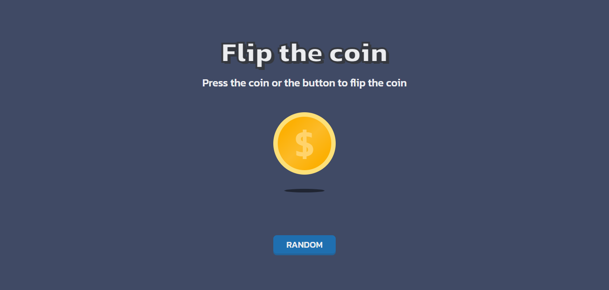

<!-- Please update value in the {}  -->

<h1 align="center">Flip the Coin | devChallenges</h1>

<div align="center">
   Solution for a challenge <a href="https://devchallenges.io/challenge/flip-the-coin" target="_blank">Flip The Coin</a> from <a href="http://devchallenges.io" target="_blank">devChallenges.io</a>.
</div>

<div align="center">
  <h3>
    <a href="https://gustavo2023.github.io/flip-the-coin/">
      Demo
    </a>
    <span> | </span>
    <a href="{https://your-url-to-the-solution}">
      Solution
    </a>
    <span> | </span>
    <a href="https://devchallenges.io/challenge/flip-the-coin">
      Challenge
    </a>
  </h3>
</div>

<!-- TABLE OF CONTENTS -->

## Table of Contents

- [Overview](#overview)
  - [What I learned](#what-i-learned)
- [Built with](#built-with)
- [Features](#features)

<!-- OVERVIEW -->

## Overview



This flip the Coin game allows the user to click on a coin or a random button to simulate a coin toss resulting in either Heads or Tails.

### What I learned

Learned about asynchronous functions in JavaScript, which allow you to perform tasks without blocking the main thread.

I used the ```setTimeout``` function in order to execute an specific function only after  certain amount of time has passed.

This project helped me understand better the use of asynchronous functions in JavaScript and CSS animations.

### Built with

- Semantic HTML5 markup
- CSS custom properties
- Flexbox

## Features

- **Interactive Coin Flip:** Users can click on the coin or the "RANDOM" button to simulate a coin flip. The coin will animate with a flipping motion, and the result (Heads or Tails) will be displayed after the animation.
- **Randomized Results:** The outcome of each coin flip is determined randomly, ensuring a fair and unpredictable result every time.
- **Simple and Clean UI:** The user interface is simple and clean, with clear instructions and easy-to-use buttons for flipping the coin.

This application/site was created as a submission to a [DevChallenges](https://devchallenges.io/challenges-dashboard) challenge.

## Author

- GitHub [@gustavo2023](https://github.com/gustavo2023)
